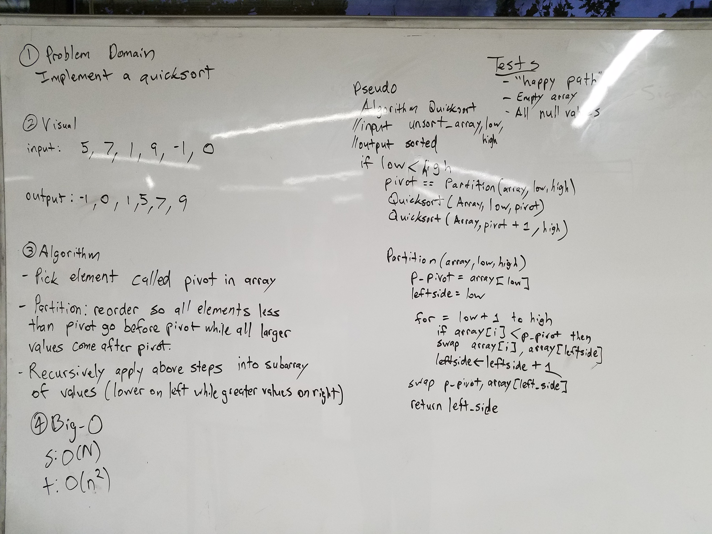

# Quicksort
Implement a quicksort.

## Challenge
The challenge is to implement a quicksort. The first step is to find a pivot point in the quicksort. The pivot is a number which will be the anchor of the array. Once a pivot is chosen, a partition will occur. All numbers to the left of the pivot will be sorted by whether the numbers are bigger or smaller than the pivot. This is one partition, or in this case, the left one. Once these numbers are sorted, the right partition will do the same. Once moved, a new pivot is chosen and will continue to be sorted by subarrays. Smaller and smaller until the whole function is completely sorted.

## Solution
​
