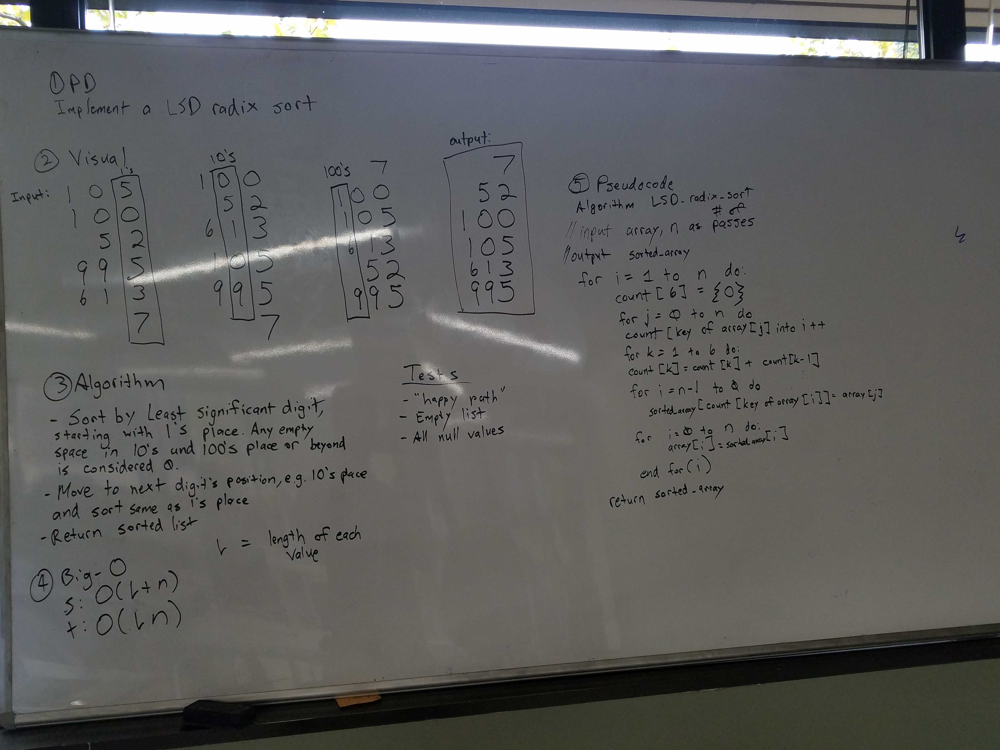

# Radix Sort (LSD)
Implement a radix sort (LSD).

## Challenge
The challenge is to implement a radix sort. The radix sort is based on how many digits are present total in the values given e.g. how many places is the highest? 1's place? 10's place? 1000's place? But the challenge here is to sort based on the 1's place first and onto the highest placed digit. See the visual below to see how it is sorted.

## Solution
​
